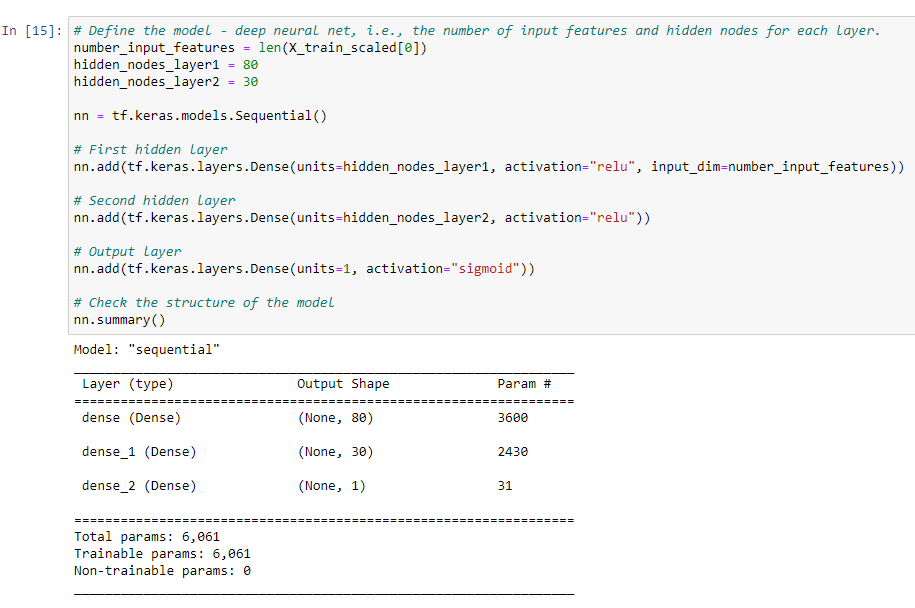
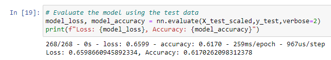
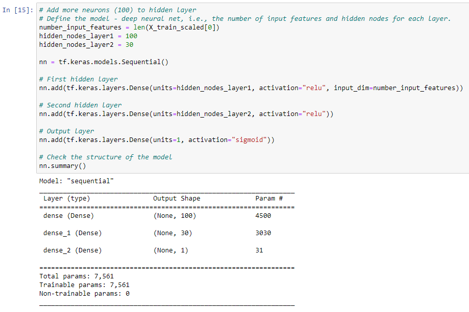
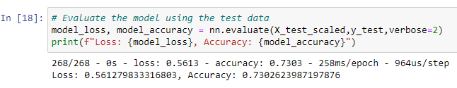
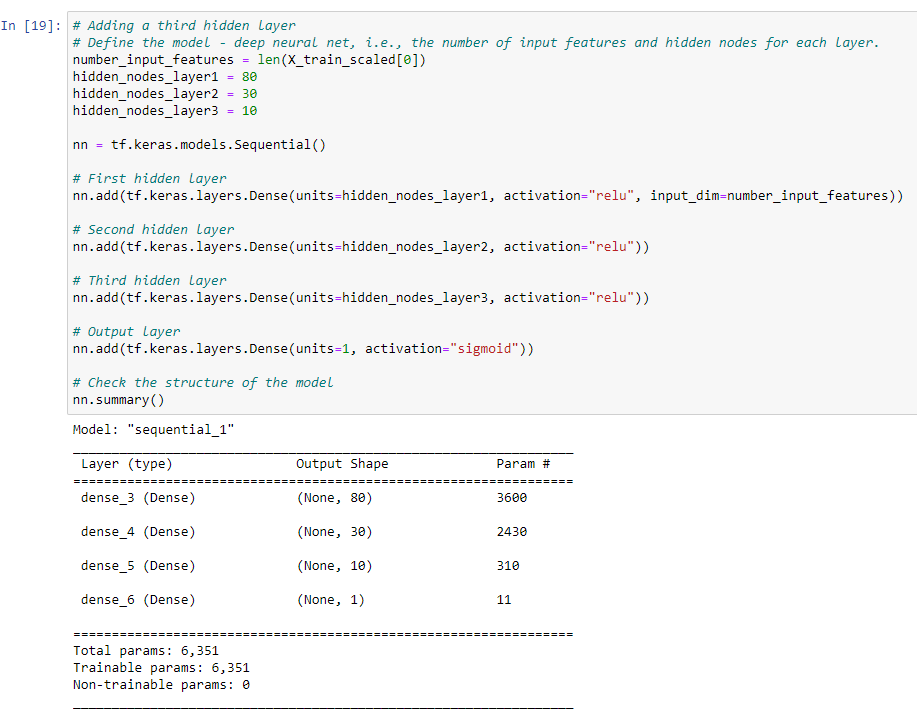
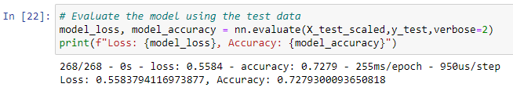
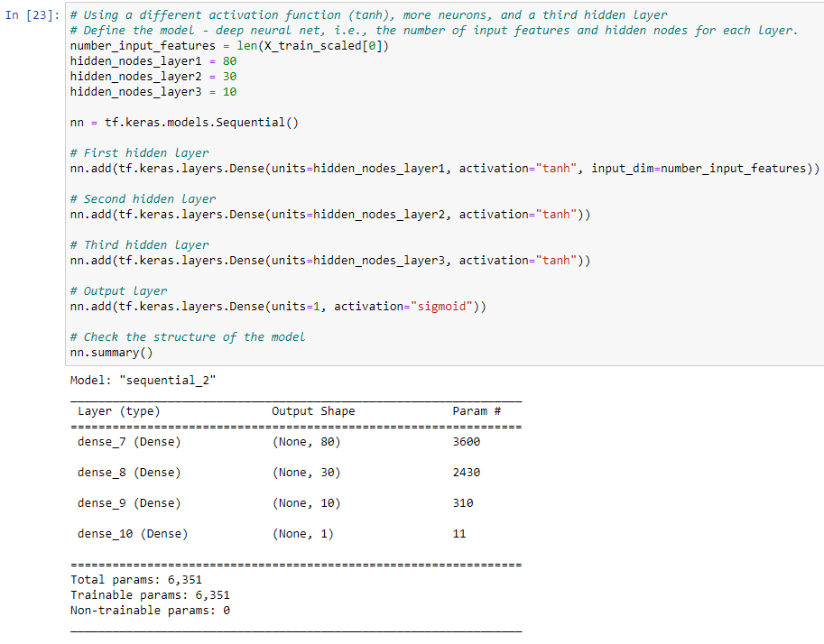
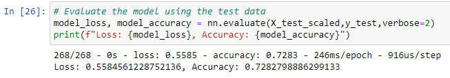

# Neural_Network_Charity_Analysis

## Overview
The purpose of this analysis was to implement machine learning and neural networks by using the features in a provided dataset to create a binary classifier that is capable of predicting whether applicants will be successful if funded by Alphabet Soup. Alphabet Soup is a fictional organization that has helped fund over tens of thousands of organizations over the years. They have sent over a CSV containing more than 34,000 organizations that have received funding from Alphabet Soup over the years. Within this dataset are a number of columns that capture metadata about each organization.

To start, Pandas and Scikit-Learn’s StandardScaler() were used to preprocess the dataset in order to compile, train, and evaluate the neural network model, which is designed with TensorFlow.

A binary classification model was created that can predict if an Alphabet Soup–funded organization will be successful based on the features in the dataset. To do this, first, the numbner of inputs were first decided on before determining the number of neurons and layers in the model. Afterwards, the binary classification model was compiled, trained, and evaluated to calculate the model’s loss and accuracy.

Finally, three attempts were made to alter and optimize the model in order to achieve a target predictive accuracy higher than 75%.

## Results

### Data Preprocessing
The variable that was considered as the target for my model was the "Is Successful" column.

The variables that were neither features nor targets were the 'EIN' and 'NAME' columns. These were dropped from the DataFrame early on during the preprocessing.

The features variables were composed of the remaining columns (Application Type, Affiliation, Classification, Use Case, Organization, Status, Income AMT, Special Considerations, and Ask AMT).

### Compiling, Training, and Evaluating the Model
During the first implementation of the model, I decided to select and use 2 hidden layers where the first layer had 80 neurons and the second hidden layer had 30 neurons. These were used along with three Rectified Linear (ReLU) activation functions (1 for each hidden layer and 1 for the output layer). After compiling, training (for 100 epochs), and evaluating the model with these parameters, I was not able to achieve an ideal target odel performance, as the accuracy score came out to be 61.7%, which was well below the 75% threshold.

In an attempt to try to increase the model's performance, several of the parameters were adjusted in three different tries. All three attempts were trained with 100 epochs. First, the number of neurons in the first hidden layer was increased from 80 to 100. The resulting accuracy score was able to increase to 73%, but this still need not neet the 75% threshold.

In the second attempt, the first hidden layer was returned to the original amount of neurons (80), but a third hidden layer of 10 neurons was added. Evaluating this model produced a 72.8% accuracy score, still below the desired 75% minimum accuracy score sought.

In a third attempt, both a third hidden layer was added with 10 neurons and the activation functions were changed from the original 'relu' activation function for the hidden and outer layers, to 'tanh' activation functions instead. This resulted in a 72.8% accuracy score again. Therefore, the 3 adjmustments made to the model were able to increase the accuracy score but not enough to reach the 75% threshold.

## Summary
Overall, the deep learning model was not able to achieve high enough scores to be considered a good model. The firsta and original model produced a realtively low accuracy score. In the three model adjustment attempts to increase the accuracy score that followed, the accuracy was able to increase but not enough to meet the standards of a model that would be considered good or reliable (at least a 75% accuracy score). It is still possible that adjusting the model in different ways could help increase the accuracy score enough to reach the desired limit. One factor that was not adjusted was the number of epochs that the model was trained with. Perhaps 100 epochs is not enough and if it were to be trained with more epochs, and may possibly produce a higher accuracy score.
